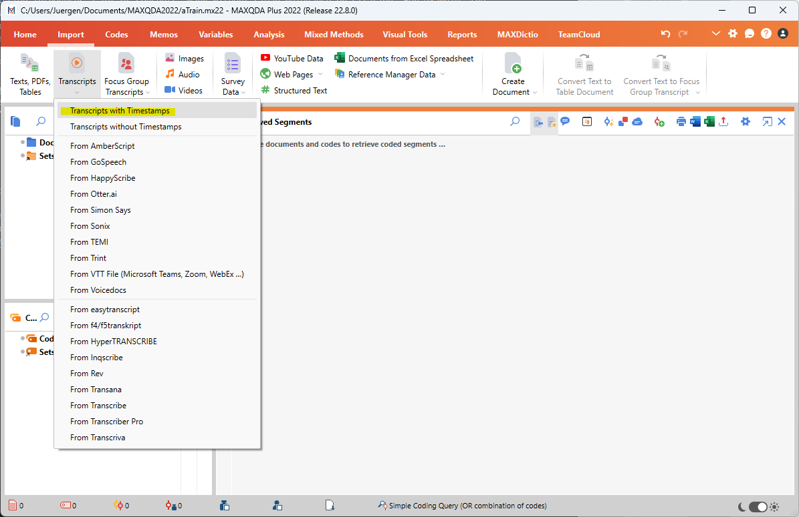
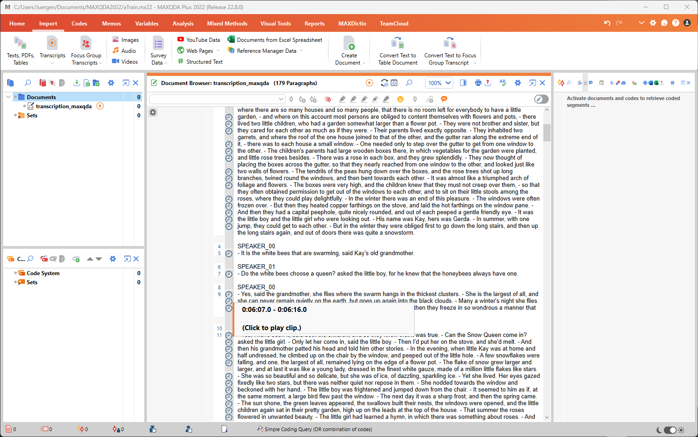
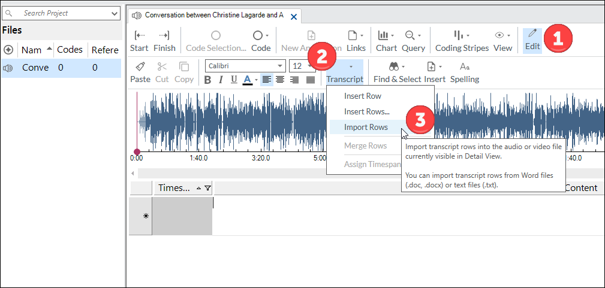
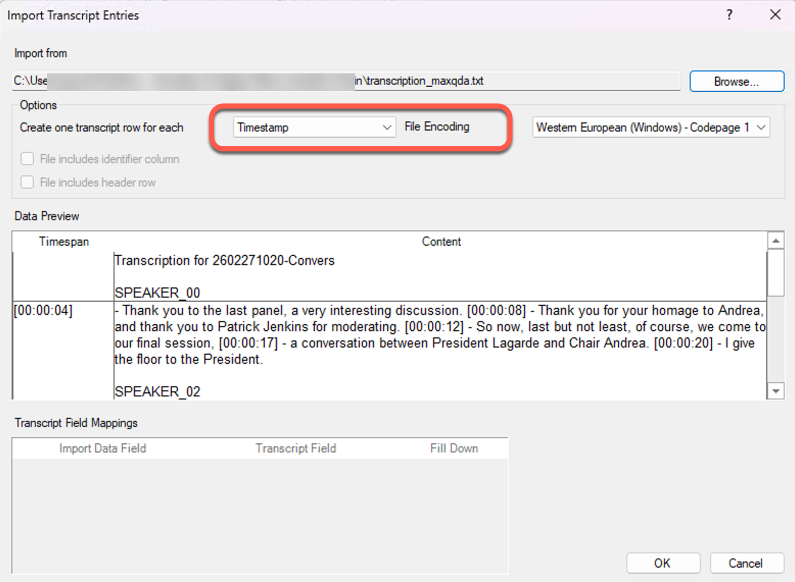
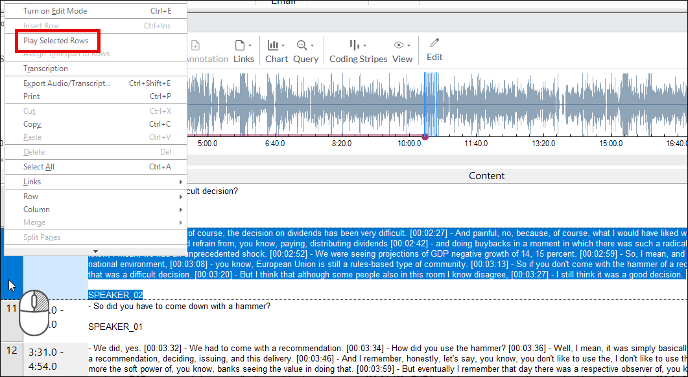

# Tutorials: importing aTrain output into QDA software

aTrain offers a number of different output formats, including the `_maxqda`
output file for integration in several widely used qualitative data analysis
(QDA) software packages, including MAXQDA, ATLAS.ti, and
[NVivo](https://help-nv.qsrinternational.com/15/win/Content/files/import-audio-video-transcripts.htm)
for Windows. This lets you sync the timestamps of the transcript with the
original audio or video file, so you can click a text passage to play the
corresponding audio/video.

## MAXQDA

Start by importing the `_maxqda` output file from aTrain via **Import →
Transcripts** and select **Transcript with Timestamps**:

Select the transcript file in the file browser opened by MAXQDA. You are then
prompted to select the media file of the transcript. Select the media file in
the file browser again. MAXQDA now imports the transcript and matches the
timestamps with the media file. Clicking the clock symbols on the left border
of the transcript plays the corresponding audio.

## NVivo

### Windows

Import the audio or video file into Documents. Open the file (double-click),
then choose **Edit**, then **Transcript** (only appears if the Edit button is
active), then **Import Rows**.

Import the `_maxqda.txt` output file from aTrain and select **Timestamp** next
to "Create one transcript row for each…".

Turn off Edit mode by clicking the Edit button again. You can now code the text
in the Content column as you would any other text, and you can either listen to
the whole recording or right-click any row and choose **Play Selected Rows**.

### macOS

NVivo for macOS can also import these transcripts, but not as they are output by
aTrain. You need to remove the `[]` from around each timestamp that starts a new
paragraph. You could search and replace **all** `[]`, but you might end up with
many more transcript rows than you want. To get one row per speaker, remove the
timestamps _within_ each section, or remove only the `[]` from each leading
timestamp. See NVivo's guide on
[importing transcripts in macOS](https://help-nv.qsrinternational.com/15/mac/Content/files/import-audio-video-transcripts.htm?Highlight=transcripts#Importatranscript).
